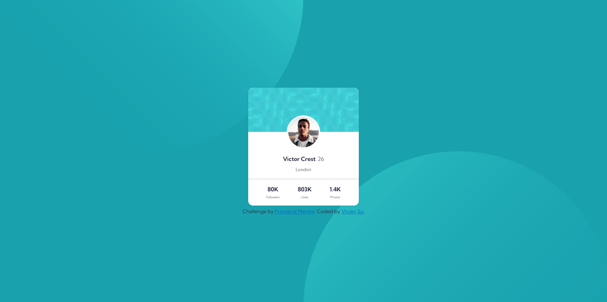

# Frontend Mentor - Profile card component solution

This is a solution to the [Profile card component challenge on Frontend Mentor](https://www.frontendmentor.io/challenges/profile-card-component-cfArpWshJ). Frontend Mentor challenges help you improve your coding skills by building realistic projects. 

## Table of contents

- [Frontend Mentor - Profile card component solution](#frontend-mentor---profile-card-component-solution)
  - [Table of contents](#table-of-contents)
  - [Overview](#overview)
    - [The challenge](#the-challenge)
    - [Screenshot](#screenshot)
    - [Links](#links)
  - [My process](#my-process)
    - [Built with](#built-with)
    - [What I learned](#what-i-learned)
    - [Useful resources](#useful-resources)
  - [Author](#author)

## Overview

### The challenge

- Build out the project to the designs provided

### Screenshot




### Links

- Solution URL: [https://www.frontendmentor.io/solutions/profile-card-component-solution--vvaz3lTKA](https://www.frontendmentor.io/solutions/profile-card-component-solution--vvaz3lTKA)
- Live Site URL: [https://yingjhen-su.github.io/frontend-mentor-profile-card/](https://yingjhen-su.github.io/frontend-mentor-profile-card/)

## My process

### Built with

- Semantic HTML5 markup
- CSS custom properties
- BEM CSS
- CSS Flexbox
- Google Fonts

### What I learned

- CSS Variables
```css
:root {
    /* FONT */
    --FF: 'Kumbh Sans', sans-serif;

    /* COLOR */
    --BGCOLOR: hsl(185, 75%, 39%);
    --MAIN-COLOR: #FFF;
    --FONT-COLOR: hsl(229, 23%, 23%);
    --FONT-COLOR-FADE: hsl(227, 10%, 46%);
    --BORDER-COLOR-PIC: #FFF;
    --SHADOW-COLOR: #333;
    --HR-COLOR: hsla(0, 0%, 59%, 0.35);
    
    /* BORDERS */
    --BORDER-PIC: 5px solid var(--BORDER-COLOR-PIC);

    /* MARGIN */
    --MARGIN: 1.25em;

    /* PADDING */
    --PADDING: 1.25em;
}
```

- Use "background-image"
```css
body {
    background-color: var(--BGCOLOR);
    background-image: url(./images/bg-pattern-top.svg), url(./images/bg-pattern-bottom.svg);
    background-position: right 50vw bottom 50vh, left 50vw top 50vh;
    background-repeat: no-repeat;
    background-attachment: fixed;
}
```

- Practical setting
```css
.offscreen {
    position: absolute;
    left: -10000px;
}

.nowrap {
    white-space: nowrap;
}
```

### Useful resources

- [CSS Full Course for Beginners](https://www.youtube.com/watch?v=n4R2E7O-Ngo) - A good course for beginners to learn CSS. It provides a comprehensive overview of various CSS concepts, covering BEM CSS and emphasizing a highly structured approach to writing CSS.

## Author

- Frontend Mentor - [@YingJhen-Su](https://www.frontendmentor.io/profile/YingJhen-Su)
